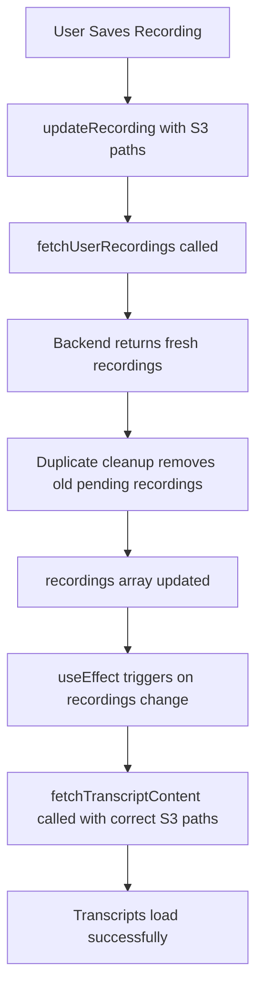

# Transcript Viewing Bug Fix Documentation

## Problem Summary

**Issue**: After completing a recording and saving it, users had to refresh the browser to view transcripts. Clicking on a saved recording immediately after saving would show "Error fetching original transcript: Forbidden" until browser refresh.

**Root Cause**: Complex state synchronization issues between frontend and backend during the recording save process, combined with recording ID mismatches and duplicate recordings in the sidebar.

## The Bug in Detail

### What Was Happening

1. **Recording Creation**: Frontend generates session ID (e.g., `20250529173520892940`)
2. **Backend Response**: Backend returns different session ID (e.g., `20250529173520977275`) 
3. **Recording Replacement Fails**: Due to React state timing issues, the old frontend recording wasn't properly replaced
4. **Duplicate Recordings**: Two recordings appeared in sidebar - old frontend ID and new backend ID
5. **S3 Path Mismatch**: When user clicked recording, wrong recording object was selected (one without S3 paths)
6. **Fetch Fails**: Transcript fetch attempted with null/undefined S3 paths → 403 Forbidden error
7. **Browser Refresh Works**: Full page reload properly synchronized state and showed correct recording

### Key Log Evidence

```
Frontend generated ID: 20250529173520892940
Backend returns ID: 20250529173520977275
TranscriptViewer shows: 20250529173520892940 (WRONG - old frontend ID)
updateRecording called with: 20250529173520977275 (correct backend ID)
Result: Two recordings in sidebar, wrong one selected
```

## The Solution

### Three-Part Fix

#### 1. Enhanced useEffect Dependencies (`RecordingsContext.jsx`)
**File**: `my-vite-react-app/src/contexts/RecordingsContext.jsx`
**Lines**: 278-342

```javascript
// BEFORE: Missing recordings dependency
}, [selectedRecordingId, fetchTranscriptContent]); 

// AFTER: Added recordings dependency to detect S3 path updates
}, [selectedRecordingId, fetchTranscriptContent, recordings]);
```

**Why**: The transcript fetching useEffect now re-runs when recording objects are updated with S3 paths.

#### 2. Auto-Refresh After Save (`RecordingView.jsx`)
**File**: `my-vite-react-app/src/components/RecordingView.jsx`  
**Lines**: 483-488

```javascript
updateRecording(sessionId, updatedRecording);

// Force refresh of recordings to ensure proper state sync
console.log('Recording updated in local state with S3 paths');
console.log('Triggering fetchUserRecordings to refresh state...');
await fetchUserRecordings();
```

**Why**: After saving, this forces a fresh fetch from the backend, ensuring state is properly synchronized.

#### 3. Duplicate Recording Cleanup (`RecordingsContext.jsx`)
**File**: `my-vite-react-app/src/contexts/RecordingsContext.jsx`
**Lines**: 68-71

```javascript
// BEFORE: Kept all local recordings
const localNonSaved = prevRecordings.filter(r => !s3Map.has(r.id));

// AFTER: Filter out old pending recordings  
const localNonSaved = prevRecordings.filter(r => 
  !s3Map.has(r.id) && 
  (r.status === 'saving' || r.status === 'failed') // Remove old 'pending' recordings
);
```

**Why**: When `fetchUserRecordings()` is called, it now removes stale 'pending' recordings that are duplicates.

#### 4. Authentication Headers (`RecordingsContext.jsx`)
**File**: `my-vite-react-app/src/contexts/RecordingsContext.jsx`
**Lines**: 250-275

```javascript
// Added authentication headers to S3 content requests
const response = await fetch(`${apiUrl}/api/v1/s3_object_content?s3_key=${encodeURIComponent(s3Key)}`, {
  headers: {
    'Authorization': `Bearer ${accessToken}`,
  },
});
```

**Why**: Ensures S3 content requests are properly authenticated.

## How The Fix Works

### The Complete Flow

1. **User starts recording** → Frontend creates pending recording with generated ID
2. **Backend returns different ID** → Recording replacement logic handles transition
3. **User saves recording** → Backend processes and returns S3 paths
4. **updateRecording called** → Local recording updated with S3 paths and 'saved' status
5. **fetchUserRecordings() called** → Fresh data fetched from backend, duplicate recordings cleaned up
6. **useEffect triggers** → Transcript fetching effect runs with correct recording object
7. **Transcripts load immediately** → User sees transcripts without browser refresh

### State Synchronization



## Files Modified

1. **`my-vite-react-app/src/contexts/RecordingsContext.jsx`**
   - Added `recordings` dependency to transcript fetching useEffect
   - Enhanced `fetchTranscriptContent` with authentication headers  
   - Added duplicate recording cleanup logic in `fetchUserRecordings`

2. **`my-vite-react-app/src/components/RecordingView.jsx`**
   - Added `await fetchUserRecordings()` call after successful save
   - Enhanced session ID replacement logging

## Key Debugging Points

If this bug reoccurs, check these areas:

### 1. Recording ID Consistency
```javascript
// Check if frontend and backend IDs match
console.log('Frontend ID:', frontendGeneratedId);
console.log('Backend ID:', backendSessionId);
console.log('Selected recording ID:', selectedRecordingId);
```

### 2. S3 Path Extraction
```javascript
// Verify S3 paths are correctly extracted
console.log('Raw S3 path:', result.saved_paths?.original_transcript);
console.log('Extracted key:', extractedOriginal);
```

### 3. useEffect Dependencies
```javascript
// Ensure useEffect has correct dependencies
useEffect(() => {
  // transcript fetching logic
}, [selectedRecordingId, fetchTranscriptContent, recordings]); // ← recordings is critical
```

### 4. Recording Array State
```javascript
// Check for duplicate recordings
console.log('All recording IDs:', recordings.map(r => ({ id: r.id, status: r.status })));
```

## Testing the Fix

### Test Scenario
1. Start a new recording
2. Speak for a few seconds
3. Stop recording
4. Click "Generate & Save Notes"
5. Wait for save to complete
6. **Immediately click on the saved recording**
7. **Verify transcripts load without browser refresh**
8. **Verify only one recording appears in sidebar**

### Expected Behavior
- ✅ Only one recording in left sidebar after save
- ✅ Transcripts load immediately when clicking saved recording
- ✅ No "Error fetching original transcript: Forbidden" errors
- ✅ No browser refresh required

## Rollback Plan

If this fix causes issues, revert these changes:

1. **Remove auto-refresh**: Delete `await fetchUserRecordings()` call in RecordingView.jsx
2. **Remove recordings dependency**: Change useEffect dependency back to `[selectedRecordingId, fetchTranscriptContent]`
3. **Restore old cleanup logic**: Revert the duplicate filtering in fetchUserRecordings

## Lessons Learned

1. **State timing is critical** in React - async state updates can cause race conditions
2. **Simple solutions often work better** than complex state management 
3. **Auto-refresh after save** is a reliable pattern for ensuring state consistency
4. **Comprehensive debugging** with detailed console logs is essential for complex bugs
5. **Recording ID mismatches** are a common source of state synchronization issues

## Prevention

To prevent similar issues in the future:

1. **Always add comprehensive logging** for state transitions
2. **Test recording ID consistency** throughout the flow
3. **Consider using auto-refresh patterns** for complex state synchronization
4. **Regularly test the full user flow** without browser refreshes
5. **Monitor useEffect dependencies** carefully for state-dependent operations

---

**Date Fixed**: 2025-05-29  
**Files Modified**: 2  
**Status**: ✅ RESOLVED  
**Impact**: Users no longer need to refresh browser to view transcripts after saving recordings